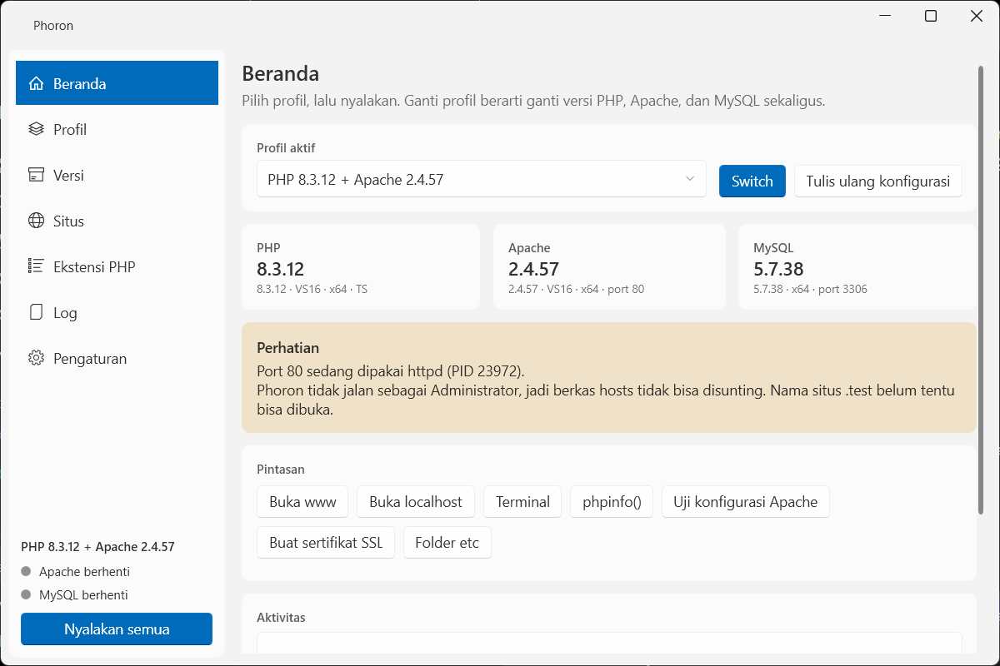
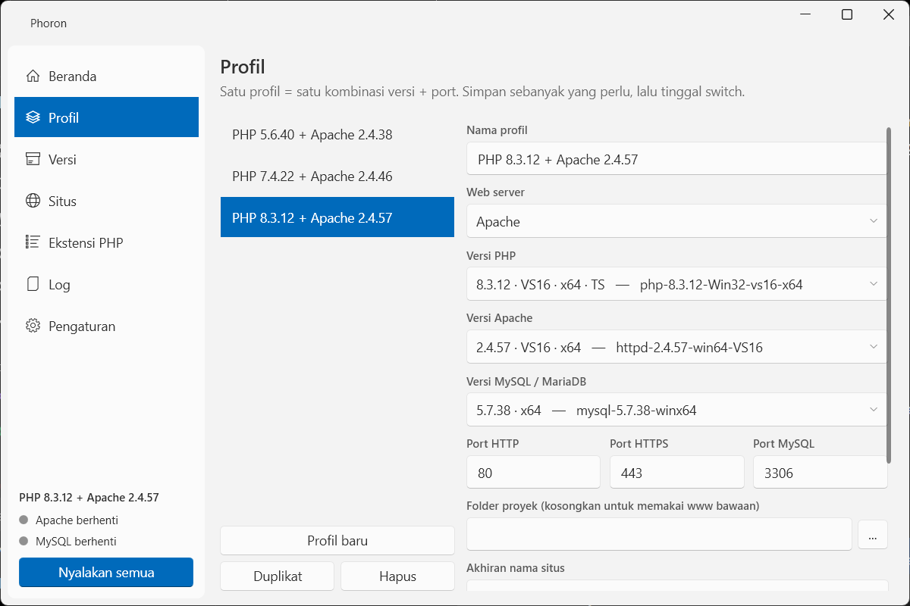

# Phoron

Lingkungan pengembangan web lokal untuk Windows — Apache/Nginx, PHP, dan MySQL —
dengan satu kelebihan yang jadi alasan utamanya dibuat: **kombinasi versi disimpan
sebagai profil, dan berpindah antar profil cukup satu klik.**

Mau menjalankan PHP 5.6 dengan Apache VC11 hari ini, lalu pindah ke PHP 8.3 dengan
Apache VS16 lima detik kemudian? Pilih profilnya, tekan Switch. Seluruh berkas
konfigurasi (httpd.conf, php.ini, my.ini, vhost, hosts) ditulis ulang sesuai profil,
lalu layanan dinyalakan ulang.




---

## Kenapa bukan Laragon saja

Laragon bisa berganti versi PHP, tapi setelan lain (versi Apache, port, ekstensi
PHP, `memory_limit`) ikut menempel di satu konfigurasi global. Phoron menyimpan
semuanya per profil:

| | Laragon | Phoron |
|---|---|---|
| Ganti versi PHP | ya | ya |
| Ganti versi Apache sekalian | manual | ikut profil |
| Ekstensi PHP per versi | satu php.ini per folder PHP | per profil |
| Port berbeda per profil | tidak | ya |
| Beberapa kombinasi tersimpan | tidak | sebanyak yang mau |

Phoron **tidak pernah menulis ke dalam folder `bin`**. Semua konfigurasi hasil
generate ada di `etc\`, jadi folder `bin` Laragon boleh dipakai bersama tanpa
kedua aplikasi saling menimpa.

---

## Pemasangan

Unduh `Phoron-<versi>-Setup.exe` dari [halaman Releases](https://github.com/Cyserrex/Phoron/releases),
atau ambil `Phoron.exe` saja — satu berkas, bisa dijalankan langsung dari mana pun.

Layar pertama installer menanyakan bahasa: **Bahasa Indonesia** (bawaan), English,
Basa Jawa, atau Bahasa Banjar. Pilihan itu bukan cuma untuk installer — ia ikut
tersimpan, jadi Phoron langsung menyala dalam bahasa yang tadi dipilih.

Kalau Anda nanti menggantinya dari **Pengaturan → Bahasa**, pemasangan ulang tidak
akan mengembalikannya: installer hanya menulis bahasa lagi kalau pilihan di
installer-nya sendiri memang berubah.

Installer menawarkan dua cara:

- **Untuk semua pengguna** (butuh admin) → dipasang ke `C:\Phoron`.
- **Hanya untuk saya** (tanpa admin) → dipasang ke folder pengguna.

Sengaja **bukan** ke Program Files: folder Phoron memuat `www\`, `data\`, dan `etc\`
yang ditulis terus-menerus, dan di bawah Program Files tulisan itu dialihkan Windows
atau ditolak.

Mencopot Phoron **tidak** menghapus proyek dan basis data Anda — installer
menanyakannya terpisah, dan pencopotan senyap tidak pernah menghapusnya.

## Jalan otomatis saat Windows menyala

Ada di **Pengaturan → Jalankan Phoron saat Windows dinyalakan**, atau bisa dicentang
saat pemasangan. Phoron mulai langsung mengecil ke baki sistem (`--tray`) tanpa
memunculkan jendela; kalau **Nyalakan layanan otomatis** juga aktif, Apache dan MySQL
ikut menyala sendiri — jadi server lokal sudah siap sebelum Anda membuka apa pun.

Caranya lewat kunci `Run` milik pengguna di registri, bukan Windows Service atau
Scheduled Task: keduanya butuh hak admin untuk dipasang, sedangkan Phoron dirancang
jalan tanpa admin. Sakelar di aplikasi dan centang di installer menulis entri yang
sama persis, jadi keduanya tidak pernah menggandakan diri.

## Cara pakai

1. Jalankan `Phoron.exe`.
2. Pada jalan pertama, Phoron memindai folder bin (miliknya sendiri **dan**
   `C:\laragon\bin` kalau ada), lalu membuatkan satu profil per versi PHP —
   masing-masing sudah dipasangkan dengan Apache bertoolset sama.
3. Pilih profil di halaman **Beranda**, tekan **Nyalakan semua**.
4. Buka `http://localhost/`.

Ganti versi: pilih profil lain → **Switch**. Kalau layanan sedang jalan, Phoron
mematikannya, menulis ulang konfigurasi, lalu menyalakannya kembali.

### Situs otomatis

Tiap subfolder di `www\` otomatis dapat vhost dan nama sendiri, mis.
`www\toko-online` → `http://toko-online.test`. Folder `public/` yang berisi
`index.php` (Laravel, Symfony) otomatis dipakai sebagai DocumentRoot.

### Folder proyek tidak harus www

Di **Profil → Folder proyek**, isi sebanyak yang perlu — satu folder per baris:

```
C:\Phoron\www
C:\laragon\www
D:\kerjaan\klien-a
```

Semuanya dipindai, dan tiap subfolder di mana pun dapat alamatnya sendiri. Folder
paling atas jadi **akar utama**: itulah yang dilayani `http://localhost` dan yang
dibuka tombol "Buka www". Daftarnya per profil, jadi profil PHP 5.6 bisa menunjuk
folder proyek lama sementara profil PHP 8.3 menunjuk folder yang baru.

Kalau dua folder berisi proyek bernama sama, yang pertama memegang nama aslinya dan
yang berikutnya diberi angka (`api.test`, `api-2.test`) — tidak ada yang dibuang
diam-diam, dan Phoron memberi tahu pasangan mana yang bentrok.

### Beranda Phoron

Ada di **`http://localhost/`** - ringkasan profil aktif, versi PHP/Apache/MySQL,
daftar situs yang bisa diklik, dan ekstensi yang benar-benar termuat. Selalu bisa
dijangkau juga di `/phoron/`.

Berkasnya tinggal di `etc\dashboard\`, bukan di folder proyek Anda - Phoron tidak
menaruh apa pun di folder kerja orang. Akar dialihkan ke sana lewat `RewriteRule`
yang mengikat alamat akar **persis**, di dalam VirtualHost bawaan:

- `http://localhost/` → beranda Phoron
- `http://localhost/simpdam/` → tetap proyek Anda, tidak tersentuh
- `http://localhost/index.php` → `index.php` milik folder proyek, tetap terjangkau

`DirectoryIndex` tidak dipakai untuk ini: ia berlaku pada **setiap** folder di
bawahnya, jadi menaruh beranda di urutan pertama akan membajak semua subfolder, dan
menaruhnya di urutan terakhir hanya berlaku kalau foldernya tidak punya index sendiri.
Aturan `mod_rewrite` juga harus berada di dalam VirtualHost - di konteks server ia
tidak diwarisi, dan gagalnya senyap: konfigurasi tetap lolos `httpd -t`, Apache tetap
menyala, aturannya saja yang tidak pernah dipakai.

Matikan lewat **Pengaturan → Tampilkan beranda Phoron di http://localhost/** kalau
akar folder proyek Anda memang aplikasi sendiri.

### HTTPS

Sertifikat wildcard untuk `*.test` dibuat **otomatis** pada penulisan konfigurasi
pertama (memakai `openssl.exe` yang ikut dalam paket Apache), jadi `https://localhost`
dan `https://proyek.test` langsung bisa dibuka. Browser masih memperingatkan sampai
sertifikatnya dipasang ke Trusted Root Windows — tombolnya ada di **Beranda → Buat
sertifikat SSL** (butuh Administrator, cukup sekali).

Kalau sertifikat belum ada, port HTTPS **tidak dibuka sama sekali**. Itu disengaja:
port yang terbuka tapi selalu gagal jauh lebih membingungkan daripada port yang
tertutup. Beranda menyebutkan statusnya, jadi tidak perlu menebak.

**Firefox punya daftar sertifikat sendiri** dan tidak otomatis ikut Trusted Root
Windows. Setelah menekan tombolnya, buka `about:config` lalu setel
`security.enterprise_roots.enabled` jadi `true` dan jalankan ulang Firefox. Chrome
dan Edge langsung ikut tanpa tambahan apa pun.

**Hati-hati dengan HSTS.** Kalau sebuah nama pernah menerima header
`Strict-Transport-Security` — `localhost` sangat sering kena, dari proyek lain yang
pernah dibuka lewat https — browser memaksa https untuk nama itu **dan menolak
menampilkan tombol "tambah pengecualian"**. Jalan keluarnya: percayai sertifikatnya
(sehingga tidak perlu pengecualian), buang entrinya lewat *Riwayat → klik kanan situs
→ Lupakan Situs Ini*, atau pakai nama `.test` proyek Anda yang tidak terkena HSTS.

Nama `.test` perlu masuk ke berkas hosts Windows, dan itu butuh hak Administrator.
Phoron menulisnya di dalam blok bertanda sendiri, jadi baris milik aplikasi lain
tidak pernah tersentuh:

```
# === Phoron mulai ===
127.0.0.1	toko-online.test
::1	toko-online.test
# === Phoron selesai ===
```

Berkas hosts itu milik sistem, bukan milik Phoron, jadi ia diperlakukan hati-hati.
Sebelum menulis, keadaan sebelumnya selalu disalin ke `data\hosts-backup\`.
Salinan pertama bernama `hosts-asli.bak` dan **tidak pernah dibuang** — itulah
keadaan sebelum Phoron ikut campur, dan itulah yang dicari orang kalau ada yang
kacau. Selebihnya bertanggal, sepuluh terbaru. Keduanya bisa dikembalikan lewat
**Pengaturan → Pulihkan berkas hosts**.

Dua penjaga lain bekerja diam-diam. Kalau berkas hosts tidak bisa **dibaca** —
terkunci antivirus, misalnya — Phoron menolak menulisnya sama sekali, sebab
menulis dari bacaan yang gagal berarti membuang seluruh baris milik Anda. Dan
sebelum menyimpan, tiap baris di luar blok Phoron dibandingkan sebelum-sesudah;
kalau ada yang akan hilang, penulisannya dibatalkan.

### Kalau ada yang tidak beres

Galat yang tidak terduga tidak lagi membuat Phoron mati tanpa jejak. Laporannya
ditulis ke `logs\crash-<tanggal>.log`, lengkap dengan versi, keadaan mesin, dan
**40 baris terakhir panel Aktivitas** — bagian terakhir itu yang paling menolong,
sebab ia menceritakan apa yang sedang dikerjakan Phoron saat itu. Dua puluh
laporan terbaru disimpan.

Untuk galat di antarmuka, Phoron tetap berjalan dan hanya memberi tahu: ia sedang
memegang Apache dan MySQL yang hidup, dan menutup diri karena satu galat kecil
berarti ikut mematikan pekerjaan Anda.

`logs\phoron.log` berputar di 2 MB dengan tiga generasi (`phoron.log.1` sampai
`.3`), jadi ia tidak lagi tumbuh tanpa batas. Semuanya bisa dibuka dari halaman
**Log**.

### Halaman yang tersedia

- **Beranda** — pilih profil, **Switch & Jalankan** (pindah profil lalu langsung nyalakan), nyalakan/matikan, pintasan (www, localhost, terminal
  dengan PATH profil aktif, `phpinfo()`, uji konfigurasi Apache, buat sertifikat SSL).
- **Profil** — sunting kombinasi versi, port, folder proyek, akhiran nama situs.
- **Versi** — daftar semua versi terpasang; tambah folder bin; unduh & pasang
  versi PHP baru langsung dari windows.php.net, atau Apache/MySQL/Nginx dari
  katalog di `etc\catalog.ini`.
- **Situs** — daftar situs, buat proyek baru, status hosts & vhost.
- **Node / TS** — jalankan Next.js, Astro, Vite, dan proyek Node lain dari folder
  mana pun (tidak harus di `www`). Skrip dibaca dari `package.json`, alamatnya
  ditangkap dari keluaran server, dan prosesnya ikut mati saat Phoron ditutup.
- **Ekstensi PHP** — centang ekstensi per profil, plus setelan php.ini yang sering
  diubah. Tombol **Uji: php -m** memperlihatkan apa yang benar-benar dimuat.
- **Log** — pembaca log Apache/MySQL/PHP/Phoron yang ikut mengekor otomatis.
- **Pengaturan** — tema, bahasa, folder bin yang dipindai, terminal, auto-start, tray,
  log, cek pembaruan.

---

## Struktur folder

```
C:\Claude\Phoron\
  Phoron.exe          satu berkas, semua DLL tertanam di dalamnya
  phoron.ini          setelan global (juga penanda akar instalasi)
  bin\                versi milik Phoron sendiri (php\, apache\, mysql\, nginx\)
  profiles\*.ini      satu berkas per profil, enak disunting tangan
  www\                folder proyek
  etc\                SELURUH konfigurasi hasil generate
    apache2\httpd.conf, mod_php.conf, ssl.conf, sites-enabled\*.conf
    php\<versi>\php.ini
    mysql\my.ini
    ssl\phoron.crt, phoron.key
    catalog.ini       daftar unduhan, boleh ditambah sendiri
  data\<versi>\       folder data MySQL, terpisah per versi
  logs\               apache-error, apache-access, mysql-error, php-error, phoron
  tmp\
```

Profil hanyalah berkas INI:

```ini
[profil]
nama=PHP 8.3 + Apache 2.4.57
web_server=apache
php=php-8.3.12-Win32-vs16-x64
apache=httpd-2.4.57-win64-VS16
mysql=mysql-5.7.38-winx64
port_http=80
port_https=443
port_mysql=3306
folder_proyek=C:\Phoron\www;C:\laragon\www

[php]
ekstensi=curl,mbstring,openssl,pdo_mysql,gd

[php.ini]
memory_limit=512M
```

---

## Tema dan bahasa

**Tema** ikut Windows secara baku, atau bisa dipaksa Terang/Gelap.

**Bahasa**: Indonesia, English, Basa Jawa, Bahasa Banjar. Nama bahasanya sengaja
tidak ikut diterjemahkan - orang mencari "English" atau "Basa Jawa", bukan
padanannya dalam bahasa yang sedang aktif, yang justru tidak mereka kenali kalau
salah pilih dan ingin kembali.

Kunci terjemahannya adalah **teks Indonesia itu sendiri**, bukan kode seperti
`nav.beranda`. Dua alasan: bahasa asal aplikasi ini memang Indonesia sehingga tidak
perlu kamus sama sekali untuk bahasa itu, dan teks yang belum diterjemahkan jatuh
kembali ke Indonesia yang benar - bukan ke kode mentah yang tidak berarti apa-apa.
Berkas XAML-nya pun tetap terbaca seperti kalimat biasa.

Istilah teknis yang memang dipakai apa adanya sehari-hari (port, profil, log)
sengaja tidak dipaksakan padanannya dalam Jawa dan Banjar; menerjemahkannya membuat
layar lebih sulit dibaca, bukan lebih ramah.

Yang sudah diterjemahkan adalah seluruh teks antarmuka: navigasi, judul halaman,
tombol, judul kolom, dan label setelan. Pesan dialog dan baris log masih Indonesia,
dan akan jatuh ke Indonesia dengan wajar sampai diterjemahkan.

## Catatan teknis

**php.ini yang sudah ada jadi dasarnya, bukan bawaan vendor.** Urutannya:
`php.ini.sebelum-phoron` → `php.ini` → `php.ini-development` → `php.ini-production`.
Folder PHP sering dipinjam dari pengelola yang sudah menyetelnya bertahun-tahun;
memulai dari bawaan vendor berarti setelan seperti `short_open_tag` diam-diam kembali
ke `Off`, dan proyek yang tadinya jalan rusak dengan galat yang jejaknya tidak
menunjuk ke Phoron sama sekali — CodeIgniter, misalnya, beralih ke jalur `eval()`
saat tag pendek mati, lalu gagal mengurai view-nya. Penimpaan di profil tetap
berkuasa di atas berkas dasar itu.

**Profil lahir dengan daftar ekstensi yang sudah terisi.** Sumbernya php.ini yang
aktif di paket PHP itu; kalau paketnya baru diunduh dan php.ini-nya belum
mengaktifkan apa pun, dipakai daftar baku (curl, fileinfo, openssl, mbstring, exif,
intl, gd, mysqli, pdo_mysql, pdo_sqlite, sqlite3, zip) yang disaring ke DLL yang
benar-benar ada di build tersebut. Profil kosong menghasilkan PHP yang mati di
pemanggilan fungsi pertama — `mb_strlen`, `mysqli_connect` — dan galatnya sering
hanya berwujud halaman putih.

**Daftar ekstensinya juga ikut diambil alih** kalau profilnya belum punya daftar
sendiri, lalu disimpan ke profil supaya terlihat dan bisa disunting. Tanpa itu,
php.ini hasil mewarisi seluruh setelan tapi tidak satu pun ekstensinya, dan aplikasi
mati dengan `Call to undefined function mb_strlen()` — yang, kalau galatnya
disembunyikan aplikasi, hanya berwujud halaman putih. Untuk profil yang terlanjur
berisi sebagian ekstensi, ada tombol **Ambil dari php.ini asli** di halaman
Ekstensi PHP.

**php.ini ditulis ke `etc\php\<versi>\`, bukan ke folder PHP.** Folder PHP sering
dipinjam dari Laragon atau XAMPP, dan php.ini di sana milik pengelola itu. Phoron
mengarahkan `PHPIniDir` Apache dan variabel `PHPRC` ke berkasnya sendiri, jadi PHP
tetap memakai setelan profil tanpa ada dua aplikasi yang berebut satu berkas.

Kalau Anda ingin `php.exe` dari editor atau Composer **di luar** Phoron ikut memakai
setelan yang sama, nyalakan **Pengaturan → Tulis php.ini ke dalam folder PHP**.
php.ini asli dicadangkan sekali ke `php.ini.sebelum-phoron`, dan cadangan itulah yang
dipakai sebagai dasar penulisan berikutnya — kalau tidak, berkasnya akan menumpuk
karena memakai keluarannya sendiri. Phoron memperingatkan bila folder PHP-nya bukan
miliknya.

**Halaman localhost adalah isi folder proyek Anda.** Phoron hanya menulis halaman
sambutannya sendiri kalau folder itu benar-benar kosong. Kalau Anda mengarahkan folder
proyek ke `C:\laragon\www`, yang muncul di `http://localhost` adalah `index.php`
milik Laragon yang sudah ada di sana — bukan tanda Phoron tidak bekerja. Menimpa
berkas di folder kerja orang bukan urusan Phoron.

**Toolset harus cocok.** Modul PHP yang dibangun dengan VC11 tidak akan dimuat
oleh httpd VS16 — dan gagalnya berupa Apache yang mati seketika tanpa pesan yang
menjelaskan. Phoron memasangkan otomatis berdasarkan toolset, dan memperingatkan
kalau Anda memilih kombinasi yang berbeda.

**PHP NTS dilayani lewat FastCGI.** Build Non Thread Safe tidak punya modul Apache.
Phoron mendeteksinya dari ada/tidaknya `php*apache2_4.dll`, lalu menjalankan
`php-cgi.exe` sebagai proses terpisah dan mengarahkan Apache ke sana lewat
`mod_proxy_fcgi`.

**httpd.conf dibangun dari salinan pristine.** Basisnya `conf\original\httpd.conf`
milik paket Apache, bukan `conf\httpd.conf` yang mungkin sudah diacak pengelola
lain. Yang diubah hanya `SRVROOT` dan `Listen`; sisanya ditambahkan sebagai blok
di akhir berkas — direktif Apache yang muncul belakangan menimpa yang di atasnya,
jadi bawaan vendor tidak perlu diobrak-abrik.

**localhost punya VirtualHost sendiri.** Apache memakai VirtualHost *pertama*
sebagai jawaban baku untuk permintaan yang tidak cocok dengan `ServerName` mana pun.
Tanpa penjaga, `http://localhost` akan dilayani situs yang kebetulan pertama menurut
abjad, bukan folder proyek utama — gejala yang baru muncul setelah situs pertama
dibuat, jadi mudah disangka kesalahan lain. Phoron selalu menulis
`sites-enabled\000-default.conf` yang urutannya dijamin paling awal.

**Pemasang menutup Phoron sendiri, berlapis.** Pertama Restart Manager, yang
dijawab Phoron dengan mematikan Apache dan MySQL lebih dulu. Kalau Phoron masih
hidup saat berkas hendak diganti, pemasang bertanya lalu menyetel event bernama
`Phoron.KeluarSekarang` - permintaan santun yang membuat Phoron berhenti lewat
jalur normalnya, termasuk `mysqladmin shutdown`. Baru kalau itu pun tidak
dijawab (versi lama tidak mengenalnya), pemasang memaksa lewat `taskkill`; sejak
1.8.1 proses anak terikat Job Object sehingga httpd dan mysqld ikut berakhir
dan tidak meninggalkan port terkunci.

**Phoron yang berjalan sebagai Administrator hanya bisa ditutup pemasang yang
juga ber-hak Administrator.** Windows melarang proses ber-integritas menengah
menyentuh proses ber-integritas tinggi, dan tidak ada DACL yang bisa
mengakalinya. Pemasang menyebutkan keadaan itu apa adanya beserta jalan
keluarnya.

Port yang masih terpakai padahal Phoron sudah tutup (sisa versi lama) hanya
diberitahukan, karena itu bukan penghalang pemasangan.

**Cek pembaruan lewat API rilis GitHub, bukan mengikis halaman.** Tata letak
halaman berubah sewaktu-waktu tanpa pemberitahuan; bentuk JSON-nya stabil. Aset
yang diambil khusus `*-Setup.exe` — rilis juga memuat `Phoron.exe`, dan mengambil
aset pertama begitu saja akan mengunduh berkas yang salah. Pengecekan otomatis
dilewati kalau baru dilakukan dalam 6 jam terakhir: API tanpa token dibatasi 60
permintaan per jam per IP. Perbandingannya angka per bagian, bukan teks — secara
abjad `1.10.0` lebih kecil daripada `1.9.0`, dan pembaruan justru akan berhenti
ditawarkan persis saat versi minor menembus angka sepuluh.

**Log rinci mati secara baku.** Log akses Apache dan seluruh keluaran layanan
tidak ditulis kecuali diminta di Pengaturan — mysqld saja mencetak ratusan baris
tiap kali menyala. Log **galat** Apache, MySQL, dan PHP tetap menyala: itulah yang
menjelaskan kalau ada yang rusak, dan menukarnya dengan beberapa megabita berarti
buta total saat dibutuhkan.

**Proyek Node dijalankan lewat package.json, bukan tebakan port.** Server
pengembangan mencetak alamatnya sendiri saat siap (Next 3000, Astro 4321, Vite
5173 — semuanya bergeser kalau portnya terpakai), jadi Phoron membaca alamat itu
dari keluarannya. Perintahnya dijalankan lewat `cmd.exe` karena npm/pnpm/yarn di
Windows berupa berkas `.cmd` yang tidak bisa dijalankan CreateProcess langsung,
dan penghentiannya membunuh seluruh pohon proses — `cmd` hanya pembungkus,
`node.exe` di bawahnyalah yang memegang port.

**Proses yang mati sendiri ketahuan.** Layanan bisa berakhir setelah dilaporkan
"jalan" — httpd yang kehabisan port, mysqld yang gagal memulihkan InnoDB. Phoron
mengawasi proses anaknya dan mengubah indikatornya jadi merah beserta alasannya,
daripada membiarkan lampu hijau menunjuk server yang sudah tidak ada.

**Konflik port dijelaskan, bukan dibiarkan.** Sebelum menyalakan, Phoron memeriksa
port dan menyebut nama proses beserta PID yang memegangnya. "Port 80 sedang dipakai
httpd (PID 23972)" jauh lebih berguna daripada Apache yang keluar dengan kode 1.

**Layanan berjalan sebagai proses biasa**, bukan Windows Service — tidak butuh hak
admin, tidak tertinggal hidup setelah aplikasi ditutup, dan dua versi berbeda bisa
ditukar tanpa pasang/copot service.

---

## Membangun dari sumber

Butuh .NET SDK (build menargetkan .NET Framework 4.8, yang sudah ada di tiap
Windows 10/11).

```
build.bat              build Release -> dist\Phoron.exe (satu berkas, ~2,9 MB)
build.bat run          build Debug lalu jalankan
build.bat test         harness uji (162 uji)
build.bat live         uji ujung-ke-ujung: menyalakan Apache & MySQL sungguhan
build.bat clean
build_installer.bat    exe + installer (butuh Inno Setup 6)
set_version.bat 1.1.0  naikkan versi di keenam berkas sekaligus
```

**Rilis otomatis.** Push ke `main` dengan nomor versi baru di `Models.cs` membuat
GitHub Actions menerbitkan rilis `v<versi>` sendiri, lengkap dengan exe dan installer.
Tag yang sudah ada dilewati, jadi push biasa tidak menimpa rilis yang sudah diunduh
orang. Naikkan versi lewat `set_version.bat`, jangan cari-ganti manual — CI menolak
build kalau nomornya tidak seragam di keenam berkas.

Uji di sini sengaja bukan uji unit murni. `build.bat test` menyuruh **httpd.exe
sungguhan** memvalidasi tiap httpd.conf yang dihasilkan (`httpd -t` dan `httpd -S`)
dan **php.exe sungguhan** memuat tiap php.ini yang ditulis (`php -m`, `php -l`).
`build.bat live` melangkah lebih jauh: menyalakan Apache untuk tiap kombinasi
PHP+Apache yang ada, mengambil halaman PHP lewat HTTP, dan memastikan versi yang
menjawab persis versi yang diminta profil — lalu menyalakan MySQL dari folder data
kosong dan menjalankan `SELECT VERSION()`.

Ikon aplikasi dirakit oleh `assets\make_icon.ps1` dari `assets\phoron-logo.png`:
pinggiran tembus pandang dipotong, hasilnya dijadikan bujur sangkar, lalu
diperkecil ke 16/24/32/48/64/128/256 dan dibungkus jadi `assets\phoron.ico`.
Ganti logonya, jalankan ulang skripnya, build — `phoron.ico` sendiri tidak
disimpan di repo karena bisa dibangkitkan ulang kapan saja.

---

## Yang belum ada

- Manajer basis data bawaan (pakai HeidiSQL/phpMyAdmin sendiri).
- Pengelolaan sertifikat per situs (sekarang satu sertifikat wildcard `*.test`).
- Nginx belum diuji seluas Apache.
